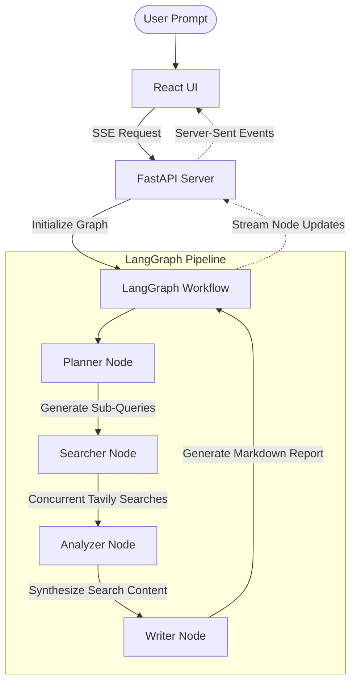

# Multi-Agent Web Research Assistant

An AI-powered web research assistant that uses **LangGraph**, **FastAPI**, and **React** to perform multi-stage online research on any user-specified topic. It queries search engines concurrently, synthesizes the results, and writes a comprehensive report, while streaming its execution state to the frontend in real time.

---

## 🗺️ System Architecture



---

## ✨ Features

- **Concurrent Multi-Stage Research**: Leverages **LangGraph** to construct a state-based workflow:
  - **Planner**: Deconstructs research topics into 3-5 targeted sub-queries.
  - **Searcher**: Runs multiple search queries concurrently to fetch high-relevance web documents.
  - **Analyzer**: Synthesizes conflicting views, facts, and key metrics.
  - **Writer**: Compiles reports into structured markdown with cited sources.
- **Real-Time Pipeline Visualization**: The React frontend visually displays the active state of each node in the LangGraph agent pipeline (`idle`, `running`, `completed`, `error`).
- **Interactive Sources**: Displays cited references, snippets, and URLs in an interactive sidebar.
- **PDF Export**: Allows downloading generated reports directly as PDF files.
- **Clean Responsive UI**: Modern dark-themed glassmorphism interface styled with custom CSS and Lucide React icons.

---

## 📂 Project Structure

- **[backend](file:///D:/Research_agent/backend)**: Python FastAPI server & LangGraph workflow.
  - **[backend/app/main.py](file:///D:/Research_agent/backend/app/main.py)**: FastAPI entrypoint setting up CORS, static routes, and the Server-Sent Events (SSE) streaming endpoint.
  - **[backend/agent/graph.py](file:///D:/Research_agent/backend/agent/graph.py)**: Defines and compiles the LangGraph workflow structure.
  - **[backend/agent/nodes.py](file:///D:/Research_agent/backend/agent/nodes.py)**: Implements LLM steps using Google Gemini models ([ChatGoogleGenerativeAI](file:///D:/Research_agent/backend/agent/nodes.py#L9)) and search clients ([AsyncTavilyClient](file:///D:/Research_agent/backend/agent/nodes.py#L25)).
  - **[backend/agent/state.py](file:///D:/Research_agent/backend/agent/state.py)**: Defines the schema for [ResearchState](file:///D:/Research_agent/backend/agent/state.py#L4).
- **[frontend](file:///D:/Research_agent/frontend)**: React application created using Vite.
  - **[frontend/src/App.jsx](file:///D:/Research_agent/frontend/src/App.jsx)**: Main dashboard page containing UI components.
  - **[frontend/src/hooks/useResearchStream.js](file:///D:/Research_agent/frontend/src/hooks/useResearchStream.js)**: State controller handling event streaming from the backend API.
  - **[frontend/src/components/](file:///D:/Research_agent/frontend/src/components)**: Component views like Header, ResearchForm, PipelineFlow, ReportView, and SourceSidebar.

---

## 🚀 Setup and Installation

### Prerequisites
- Python 3.13+
- Node.js 18+
- API Keys:
  - **Google Gemini API Key** (`GOOGLE_API_KEY`)
  - **Tavily Search API Key** (`TAVILY_API_KEY`)

### Backend Setup
1. Navigate to the project root and create a virtual environment:
   ```bash
   python -m venv .venv
   .venv\Scripts\activate  # Windows
   # or: source .venv/bin/activate (macOS/Linux)
   ```
2. Install the backend dependencies:
   ```bash
   pip install -r requirements.txt
   ```
3. Create a `.env` file in the root directory and define the following variables:
   ```env
   GOOGLE_API_KEY=your_gemini_api_key_here
   TAVILY_API_KEY=your_tavily_api_key_here
   ```
4. Run the FastAPI development server:
   ```bash
   python backend/app/main.py
   ```
   The backend API will run at `http://127.0.0.1:8000`.

### Frontend Setup
1. Open a new terminal and navigate to the frontend directory:
   ```bash
   cd frontend
   ```
2. Install the frontend packages:
   ```bash
   npm install
   ```
3. Start the Vite React development server:
   ```bash
   npm run dev
   ```
   The frontend UI will run at `http://localhost:5173`.

---

## 🛠️ Roadmap: Planned Features

The following features are scheduled for development to make the assistant enterprise-grade:

### 1. User Authentication & Authorization
- **Secure JWT Tokens**: Register and log in users with token-based session persistence.
- **Third-Party Sign-In**: Integration with external providers (OAuth2, Supabase, or Firebase Auth).
- **Session Management**: Secure cookies or LocalStorage strategies with token expiration safeguards.

### 2. Usage Rate Limiting & User Tiers
- **Daily Search Credits**: Imposing daily limits on the number of generated research reports (e.g. 5 reports/day for free users).
- **Tier Upgrades**: Premium tier options offering unlimited searches and deeper search settings.
- **Real-Time Credits Counter**: Dashboard widget monitoring daily remaining limits.

### 3. Advanced Search & Customization
- **Research Length Selection**: Options to generate quick summaries vs. extensive deep-dives.
- **Specific Domains Whitelist**: Ability to constrain Tavily searches to specific domains (e.g., `.gov`, `.edu`, or specialized news sites).
- **Targeted Output Formats**: Choose formatting variations (PDF, CSV data tables, slides).

### 4. Database Caching & History Cache
- **SQL Database Integration**: Cache and store research reports in an SQLite/PostgreSQL database to view search history.
- **Duplicate Topic Caching**: Prevent duplicate search query API costs by fetching cached results if a topic was searched recently.
- **Global Search History**: Shared workspace or library for users to browse previously generated reports.
